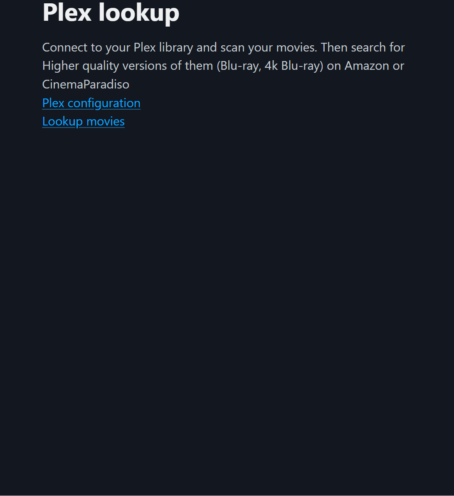

# plex-lookup

## Description

A tool to compare your plex libraries with other physical media rental / purchasing services.



## Table of Contents

- [Features](#features)
- [Running](#running)
  - [Docker](#docker)
  - [Binaries](#binaries)
- [Building](#building)

## Features

- [x] Movies
  - [x] amazon via blu-ray.com (customisable region)
  - [x] cinema paradiso
  - [x] filter by resolution, audio language or new releases
  - [x] use playlists to filter what you search for
- [x] TV
  - [x] amazon via blu-ray.com (customisable region)
  - [x] cinema paradiso
  - [x] filter by resolution, audio language or new releases
- [x] Music
  - [x] spotify (requires a client id and secret)
  - [x] musicbrainz (can use a local copy of the database)
  - [x] find new releases, or find similar new artists
  - [x] use playlists to filter what you search for
- [x] Runs locally
  - [x] no data is stored
  - [x] no ads
  - [x] no tracking
- [x] simple to use
  - [x] threaded search
  - [x] built in backoffs for api rate limits
  - [x] run as a web server or cli tool
- [x] os agnostic
  - [x] runs on windows, mac, linux

## Running

Available as a docker image or as a binary.

### Docker

You can get the docker image here [tphoney/plex-lookup](https://hub.docker.com/r/tphoney/plex-lookup).
The latest image is built from the latest commit on the main branch. Versioned images are also available.

```bash
docker run --rm  -p 9090:9090 tphoney/plex-lookup
```

### Binaries

Available in tar files in the releases section [here](https://github.com/tphoney/plex-lookup/releases). Runs the web server on port 9090 by default.

```bash
./plex-lookup web 
# on windows
.plex-lookup.exe web
```

## Building

Build the binary.

```bash
go test -v --race ./... 
go build
```
